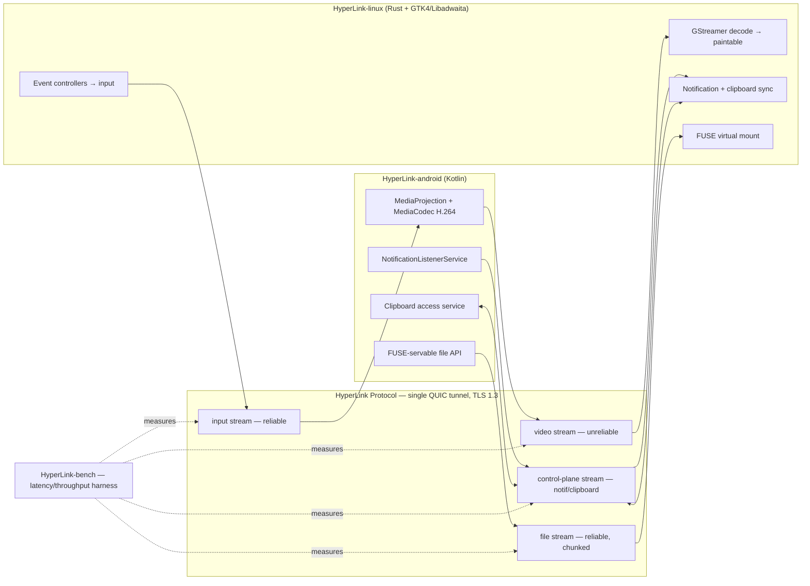

# HyperLink

**Linux ⇄ Samsung, one continuous compute surface.**

A from-scratch, low-latency device-union protocol — mirrored display, shared input, notifications, clipboard, and files between a Linux host and a Samsung Android device over a single multiplexed QUIC tunnel. Built as a clean-room alternative to closed device-linking protocols, not a reverse-engineering of them.

[](LICENSE)


[](https://github.com/<your-username>/HyperLink/actions/workflows/ci.yml)

## Why

Existing solutions either compromise on latency (standard screen mirroring over Wi-Fi) or require closed, vendor-locked protocols (Microsoft Phone Link, Samsung Link to Windows). HyperLink is a single, versioned, self-hosted protocol — no cloud account, no vendor lock-in — built around one goal: make the boundary between your phone and your Linux desktop disappear, honestly, within what stock hardware actually allows.

## Architecture



Full breakdown: [`docs/ARCHITECTURE.md`](docs/ARCHITECTURE.md)

## Build Status

Full plan with a measured Definition-of-Done per phase: [`docs/SYSTEM_DESIGN.md`](docs/SYSTEM_DESIGN.md)

## Tech Stack

| Layer | Choice | Rationale |
|---|---|---|
| Transport | QUIC / TLS 1.3 | Multiplexed streams, no head-of-line blocking |
| Linux host | Rust, GTK4, Libadwaita | Tail latency matters; no GC pauses |
| Android companion | Kotlin | Full `MediaProjection`/`MediaCodec`/`NotificationListener` access |
| Hot-path serialization | FlatBuffers | Zero-copy for video/input |
| Control-plane serialization | Protobuf | Ergonomics over raw throughput |
| Pairing | TOFU cert fingerprint | No cloud account dependency |

Decision rationale for each of these: [`docs/adr/`](docs/adr/)

## Security

Threat model tracked from day one, not bolted on at the end: [`docs/THREAT_MODEL.md`](docs/THREAT_MODEL.md)

## Repository Structure

```
HyperLink/
├── protocol/     # shared wire schema — source of truth for both sides
├── android/      # Kotlin companion service
├── linux/        # Rust host application
├── bench/        # latency/throughput measurement harness
└── docs/         # system design, architecture, ADRs, threat model
```

## Status

This project is in the design/architecture phase. Implementation follows the phased plan in `docs/SYSTEM_DESIGN.md`, gated by measured Definition-of-Done criteria — no phase ships on "it feels fast," only on logged numbers from `bench/`.

## Contributing

See [`CONTRIBUTING.md`](CONTRIBUTING.md).

## License

Apache License 2.0 — see [`LICENSE`](LICENSE).
