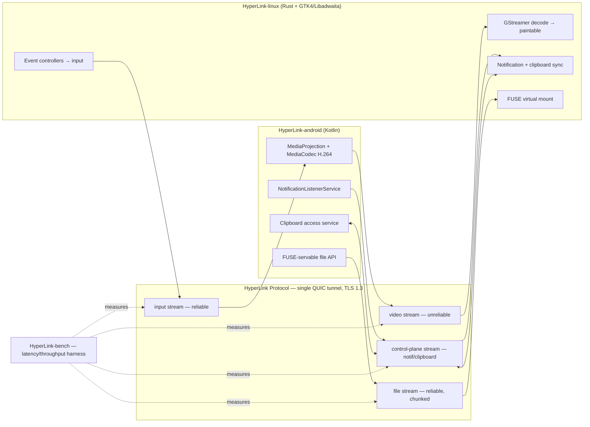

# HyperLink

**Linux ⇄ Samsung, one continuous compute surface.**

A from-scratch, low-latency device-union protocol — mirrored display, shared input, notifications, clipboard, and files between a Linux host and a Samsung Android device over a single multiplexed QUIC tunnel. Built as a clean-room alternative to closed device-linking protocols, not a reverse-engineering of them.

[](LICENSE)


[](https://github.com/arjun-kale/hyperlink/actions/workflows/ci.yml)

## Why

Existing solutions either compromise on latency (standard screen mirroring over Wi-Fi) or require closed, vendor-locked protocols (Microsoft Phone Link, Samsung Link to Windows). HyperLink is a single, versioned, self-hosted protocol — no cloud account, no vendor lock-in.

- **One QUIC tunnel, not five sockets.** Video, input, notifications, clipboard, and file access are separate multiplexed streams over one mTLS-authenticated connection — a large file transfer can't stall a video frame or an input event.
- **No cloud account, no relay.** Pairing is Trust-On-First-Use with a certificate fingerprint confirmed by a 6-digit PIN, the same model KDE Connect and Signal's safety numbers use.
- **Freshness over completeness for video.** The mirror stream drops stale frames rather than buffering — a live view of the phone, not a video call.
- **An ambient context agent, not just a mirror.** A privacy-gated local event bus lets a desktop AI agent answer "what happened on my phone in the last hour?" without ever seeing raw video or clipboard content unless explicitly granted.
- **Phase-gated, honestly.** Every phase ships against a measured Definition-of-Done, not "it feels fast" — see the per-phase status notes in [`CHANGELOG.md`](CHANGELOG.md) for exactly what's hardware-validated versus still simulation-tested.

## Status

Phases 1-11 of the build plan in [`docs/SYSTEM_DESIGN.md`](docs/SYSTEM_DESIGN.md) exist in code, build, and pass their unit/simulation tests. This is **not yet a released, hardware-validated product** — most phases still need their physical Definition-of-Done verified on real devices, and a few known gaps (proximity pre-warming's architecture, Phase 7's automatic failover wiring) are documented rather than silently claimed as done. [`CHANGELOG.md`](CHANGELOG.md) is the source of truth for what's actually finished versus what's built-but-unverified, phase by phase.

## Quick Start

Full walkthrough, including Android permission grants and troubleshooting: [`docs/ONBOARDING.md`](docs/ONBOARDING.md). The short version:

```sh
# Linux host — headless daemon (no GUI dependencies required)
git clone https://github.com/arjun-kale/hyperlink.git && cd hyperlink
cargo build --release -p hyperlink-linux
./target/release/hyperlink-linux --pair    # first run: pair a phone, confirm the PIN
./target/release/hyperlink-linux           # subsequent runs

# Android companion
cd android && ./gradlew assembleDebug
adb install -r app/build/outputs/apk/debug/app-debug.apk
```

The GUI build (mirror window, preferences, notification toasts) needs GTK4/Libadwaita/GStreamer dev packages — see `docs/ONBOARDING.md` for the package list, then build with `cargo build --release -p hyperlink-linux --features video`.

### Linux host CLI

| Flag | Default | Description |
|---|---|---|
| `--bind` | `0.0.0.0:9900` | Address to bind the QUIC server to |
| `--name` | `Linux-Host` | Device name advertised over mDNS |
| `--pair` | off | Start in pairing mode to trust a new device |
| `--config` | `~/.config/hyperlink/host_config.json` | Path to host credentials and paired-device config |
| `--agent-query <text>` | — | Run a natural-language query against the ambient context agent and exit |

## Architecture


```mermaid
flowchart LR
    subgraph Phone["HyperLink-android (Kotlin)"]
        A1[MediaProjection + MediaCodec H.264]
        A2[NotificationListenerService]
        A3[Clipboard access service]
        A4[FUSE-servable file API]
    end

    subgraph Tunnel["HyperLink Protocol — single QUIC tunnel, TLS 1.3"]
        S1[video stream — unreliable]
        S2[input stream — reliable]
        S3[control-plane stream — notif/clipboard]
        S4[file stream — reliable, chunked]
    end

    subgraph Host["HyperLink-linux (Rust + GTK4/Libadwaita)"]
        H1[GStreamer decode → paintable]
        H2[Event controllers → input]
        H3[Notification + clipboard sync]
        H4[FUSE virtual mount]
    end

    A1 --> S1 --> H1
    H2 --> S2 --> A1
    A2 --> S3 --> H3
    A3 <--> S3 <--> H3
    A4 --> S4 --> H4

    Bench[HyperLink-bench — latency/throughput harness]
    Bench -.measures.-> S1
    Bench -.measures.-> S2
    Bench -.measures.-> S3
    Bench -.measures.-> S4
```

Full breakdown: [`docs/ARCHITECTURE.md`](docs/ARCHITECTURE.md). Full phased build plan with a measured Definition-of-Done per phase: [`docs/SYSTEM_DESIGN.md`](docs/SYSTEM_DESIGN.md).

## Tech Stack

| Layer | Choice | Rationale |
|---|---|---|
| Transport | QUIC / TLS 1.3 | Multiplexed streams, no head-of-line blocking |
| Linux host | Rust, GTK4, Libadwaita | Tail latency matters; no GC pauses |
| Android companion | Kotlin | Full `MediaProjection`/`MediaCodec`/`NotificationListener` access |
| Hot-path wire format | Custom binary framing | Zero-copy-friendly for video/input |
| Control-plane payloads | JSON | Ergonomics over raw throughput for notification/clipboard/handoff/ambient metadata |
| Pairing | TOFU cert fingerprint + PIN | No cloud account dependency |

Decision rationale for each of these: [`docs/adr/`](docs/adr/).

## Security

Threat model tracked from day one, not bolted on at the end: [`docs/THREAT_MODEL.md`](docs/THREAT_MODEL.md). Code-level review of the pairing/auth flow specifically (not a substitute for a third-party pen-test): [`docs/SECURITY_REVIEW.md`](docs/SECURITY_REVIEW.md). Found a vulnerability? See [`SECURITY.md`](SECURITY.md) for how to report it privately.

## Repository Structure

```
hyperlink/
├── protocol/       # shared wire schema — source of truth for both sides
├── android/        # Kotlin companion app
├── android-bridge/ # Rust JNI bridge linking the Android app to protocol/
├── linux/          # Rust host application (daemon + GTK4/Libadwaita GUI)
├── bench/          # latency/throughput/reliability measurement harness
└── docs/           # system design, architecture, ADRs, threat model, specs
    └── adr/         # Architecture Decision Records
```

## Contributing

See [`CONTRIBUTING.md`](CONTRIBUTING.md) for the development process, and [`CODE_OF_CONDUCT.md`](CODE_OF_CONDUCT.md) for community guidelines.

## License

Apache License 2.0 — see [`LICENSE`](LICENSE).
