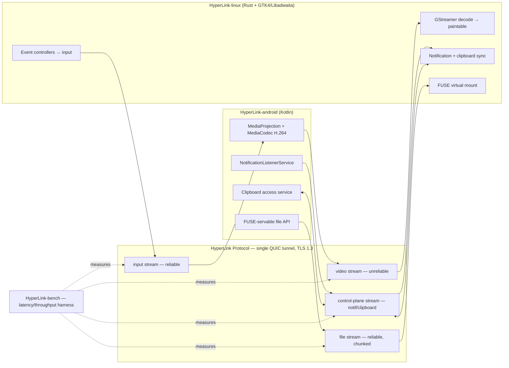

<p align="center"></p>

# HyperLink

**Your Android phone, on your Linux computer.**

See and control your phone's screen with your mouse and keyboard, get its notifications on your desktop, copy on one device and paste on the other, and browse its files from your file manager. Everything goes directly between your devices over your own Wi-Fi — no account, no cloud.

[](LICENSE)


[](https://github.com/arjun-kale/hyperlink/actions/workflows/ci.yml)

## What you need

- A Linux computer with GNOME or another modern desktop (tested on Ubuntu 26.04; release builds target Ubuntu 24.04 and newer).
- An Android phone running Android 12 or newer (tested on Samsung Galaxy A15, A71 and M54).
- Both on the same Wi-Fi network.

## Install

Download both apps from the [latest release](https://github.com/arjun-kale/hyperlink/releases/latest).

**On your computer**, install the media packages HyperLink uses, then the app:

```sh
sudo apt install gstreamer1.0-plugins-bad gstreamer1.0-libav gstreamer1.0-gtk4 \
  wl-clipboard fuse3 libnotify-bin
# Hardware video decoding (recommended). On Ubuntu 26.04 it's a separate package:
sudo apt install gstreamer1.0-plugins-extra

tar xzf hyperlink-linux-*-x86_64.tar.gz && cd hyperlink-linux-*-x86_64
./linux/packaging/install-local.sh --no-build
```

HyperLink then appears in your apps. (`./linux/packaging/install-local.sh --uninstall` removes it.)

**On your phone**, open the downloaded `HyperLink-*.apk` and install it. If Android refuses, see [Installing the APK](docs/ONBOARDING.md#installing-the-apk) — Google Play Protect and Samsung Auto Blocker block apps that ask for notification and accessibility access when they don't come from an app store.

## Set up (once)

1. On your computer, open **HyperLink** and click **Start Pairing**.
2. On your phone, open **HyperLink**, tap **Get started**, then tap your computer.
3. Your phone shows a code. On your computer, click the same code, then tap **Pair** on the phone.
4. On the phone, turn on the features you want from the checklist (notifications, control from PC, files, Do Not Disturb sync).

From then on they connect by themselves whenever both are on the same Wi-Fi — even with the phone app closed. To see your phone's screen on the computer, tap **Show screen on PC** on the phone.

Full guide and troubleshooting: [docs/ONBOARDING.md](docs/ONBOARDING.md). How HyperLink handles your data: [PRIVACY.md](PRIVACY.md).

## Good to know

- **Clipboard from computer to phone** works when the HyperLink window is focused on GNOME, because GNOME only tells the focused app about clipboard changes. Phone to computer always works.
- **Controlling the phone** needs HyperLink's Accessibility permission; Android has no other way for an app to tap the screen.
- **Status**: beta. Daily use works, but some features (multipath failover, proximity pre-warm) are still experimental — see [CHANGELOG.md](CHANGELOG.md).

## Build from source

```sh
# Linux app (needs libgtk-4-dev, libadwaita-1-dev, libgstreamer1.0-dev, libgstreamer-plugins-base1.0-dev)
cargo build --release -p hyperlink-linux --features video
./linux/packaging/install-local.sh --no-build      # or run ./target/release/hyperlink-linux

# Android app
cd android && ./gradlew assembleRelease            # app/build/outputs/apk/release/
```

Without `--features video` you get a headless daemon (pairing in the terminal, no window). Releases are built by [`.github/workflows/release.yml`](.github/workflows/release.yml) from a version tag; see [docs/RELEASING.md](docs/RELEASING.md).

## Architecture


```mermaid
flowchart LR
    subgraph Phone["HyperLink-android (Kotlin)"]
        A1[MediaProjection + MediaCodec H.264]
        A2[NotificationListenerService]
        A3[Clipboard access service]
        A4[FUSE-servable file API]
    end

    subgraph Tunnel["HyperLink Protocol — single QUIC tunnel, TLS 1.3"]
        S1[video stream — unreliable]
        S2[input stream — reliable]
        S3[control-plane stream — notif/clipboard]
        S4[file stream — reliable, chunked]
    end

    subgraph Host["HyperLink-linux (Rust + GTK4/Libadwaita)"]
        H1[GStreamer decode → paintable]
        H2[Event controllers → input]
        H3[Notification + clipboard sync]
        H4[FUSE virtual mount]
    end

    A1 --> S1 --> H1
    H2 --> S2 --> A1
    A2 --> S3 --> H3
    A3 <--> S3 <--> H3
    A4 --> S4 --> H4

    Bench[HyperLink-bench — latency/throughput harness]
    Bench -.measures.-> S1
    Bench -.measures.-> S2
    Bench -.measures.-> S3
    Bench -.measures.-> S4
```

Full breakdown: [`docs/ARCHITECTURE.md`](docs/ARCHITECTURE.md). Full phased build plan with a measured Definition-of-Done per phase: [`docs/SYSTEM_DESIGN.md`](docs/SYSTEM_DESIGN.md).

## Tech Stack

| Layer | Choice | Rationale |
|---|---|---|
| Transport | QUIC / TLS 1.3 | Multiplexed streams, no head-of-line blocking |
| Linux host | Rust, GTK4, Libadwaita | Tail latency matters; no GC pauses |
| Android companion | Kotlin | Full `MediaProjection`/`MediaCodec`/`NotificationListener` access |
| Hot-path wire format | Custom binary framing | Zero-copy-friendly for video/input |
| Control-plane payloads | JSON | Ergonomics over raw throughput for notification/clipboard/handoff/ambient metadata |
| Pairing | TOFU cert fingerprint + PIN | No cloud account dependency |

Decision rationale for each of these: [`docs/adr/`](docs/adr/).

## Security

Threat model tracked from day one, not bolted on at the end: [`docs/THREAT_MODEL.md`](docs/THREAT_MODEL.md). Code-level review of the pairing/auth flow specifically (not a substitute for a third-party pen-test): [`docs/SECURITY_REVIEW.md`](docs/SECURITY_REVIEW.md). Found a vulnerability? See [`SECURITY.md`](SECURITY.md) for how to report it privately.

## Repository Structure

```
hyperlink/
├── protocol/       # shared wire schema — source of truth for both sides
├── android/        # Kotlin companion app
├── android-bridge/ # Rust JNI bridge linking the Android app to protocol/
├── linux/          # Rust host application (daemon + GTK4/Libadwaita GUI)
├── bench/          # latency/throughput/reliability measurement harness
└── docs/           # system design, architecture, ADRs, threat model, specs
    └── adr/         # Architecture Decision Records
```

## Contributing

See [`CONTRIBUTING.md`](CONTRIBUTING.md) for the development process, and [`CODE_OF_CONDUCT.md`](CODE_OF_CONDUCT.md) for community guidelines.

## License

Apache License 2.0 — see [`LICENSE`](LICENSE).
