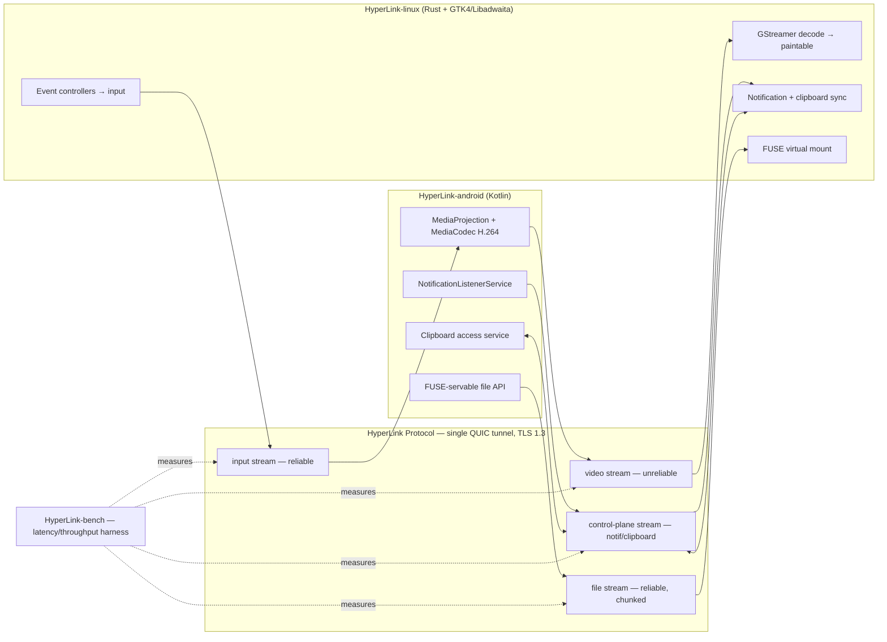

# Architecture

## Overview

## Component Responsibilities

### `protocol/`
Shared, versioned wire schema — FlatBuffers for the video/input hot path, Protobuf for control-plane. Both `android/` and `linux/` implement this contract independently; neither side is treated as "the reference implementation."

### `android/`
Kotlin foreground service. Owns screen capture and hardware encode, input event injection, notification listening, clipboard access, and the file-serving side of the FUSE mount.

### `linux/`
Rust + GTK4/Libadwaita application. Owns the QUIC endpoint (recommended as the listening/server side, since it's the more stable, always-addressable endpoint on a LAN), the GStreamer decode pipeline, input capture, the FUSE mount, and the Libadwaita UI.

### `bench/`
Standalone measurement harness. Not a feature — a tool. Every phase's Definition-of-Done in `docs/SYSTEM_DESIGN.md` is validated through this, not eyeballed.

## Stream Design

| Stream | Direction | Reliability | Payload format |
|---|---|---|---|
| video | phone → host | unreliable, drop-stale | FlatBuffers header + raw H.264 NAL units |
| input | host → phone | reliable, ordered | FlatBuffers |
| control-plane | bidirectional | reliable | Protobuf |
| file | bidirectional | reliable, chunked | Protobuf header + raw bytes |

## Why One QUIC Tunnel Instead of Several Sockets

A single tunnel with multiplexed streams means a large file transfer on the file stream cannot stall a video frame on the video stream — TCP's head-of-line blocking is exactly what QUIC's stream independence avoids. It also means one pairing/auth handshake secures every feature, rather than re-authenticating per socket.

## Trust Model

TLS 1.3 is mandatory on every connection. First pairing exchanges a certificate fingerprint over a QR code or PIN — Trust-On-First-Use, the same model KDE Connect and Signal's safety numbers use. No cloud account, no third-party relay. See `docs/adr/0005-pairing-trust-on-first-use.md`.
